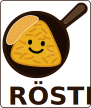

  
A small Cuda rasterizer in C++ also providing python bindings.
  
The tiled rasterizer uses an approach similar to gaussian splatting, sorting all primitives in their respective tiles, therefore enabling correct order dependent blending out of the box.
  
  
There are two cmake options to enable/disable the C++ testbench and the python bindings:
- `ROESTI_ENABLE_TESTBENCH` (default: ON): Enables building the C++ testbench.
- `ROESTI_ENABLE_PYTHON` (default: ON): Enables building the Python bindings.
